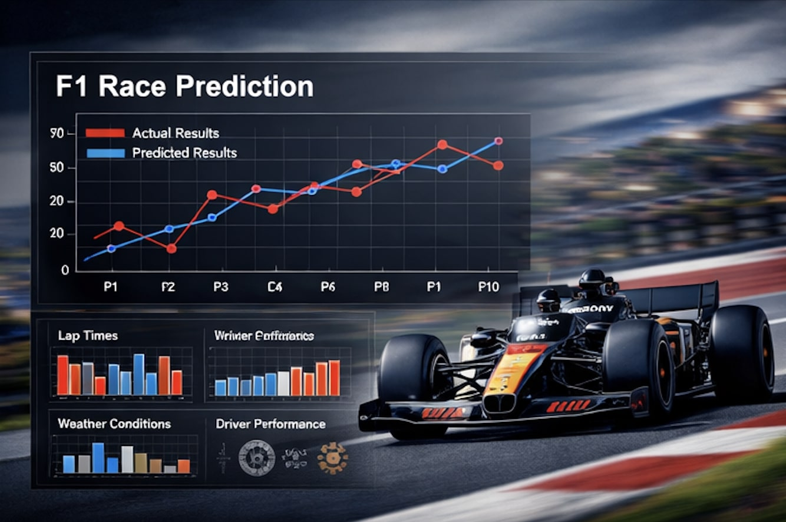
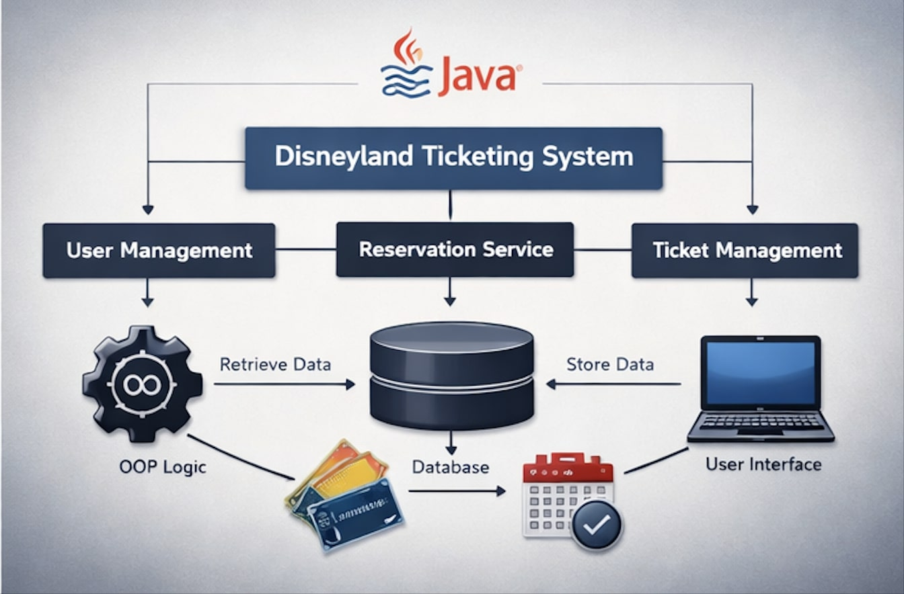

<!DOCTYPE html>
<html lang="en">
<head>
<meta charset="UTF-8">
<title>Walid Bessis | Portfolio</title>
<link rel="stylesheet" href="assets/css/style.css">
<meta name="viewport" content="width=device-width, initial-scale=1.0">
</head>

<body>

<section class="hero">
  

    <h1>Walid Bessis</h1>
    <h2>Engineering Student – Data Science & Artificial Intelligence</h2>
    
Turning data into insight, and insight into real-world impact.

  

</section>

<section class="section fade-in">
  <h3>About me</h3>
  

  I am a fourth year engineering student at ESIEA, specialized in Data Science and Artificial Intelligence within an international curriculum taught in English.
  My background combines data analysis, software development and applied AI, with a strong interest in complex systems and mobility related technologies.
  Through my academic and personal projects, I focus on building reliable, data driven solutions with real world relevance.
  

</section>

<section class="section fade-in">
  <h3>Projects</h3>

  

    
    

      <h4>Formula 1 race results prediction</h4>
      

      This project explores the use of data analysis and machine learning to predict the outcome of Formula 1 races.
      Historical race data was collected, cleaned and analyzed using Python.
      Several supervised learning models were trained to identify performance patterns based on drivers, teams and race features.
      The project highlighted the importance of feature engineering, model evaluation and data quality in motorsport analytics.
      

      Python · Pandas · Scikit-learn · Data Analysis
    

  

  

    
    

      <h4>Village Locker – Connected locker system</h4>
      

      Village Locker is a connected locker solution designed to simplify parcel delivery and pickup in rural areas.
      I worked on the development of a cross platform mobile application using React Native and Expo, focusing on user interaction and system architecture.
      This project strengthened my skills in application design, backend communication and real world product thinking.
      

      React Native · Expo · Application Architecture
    

  

  

    
    

      <h4>Disneyland ticketing system</h4>
      

      Academic Java project simulating a ticketing and reservation system.
      The application was built following object oriented programming principles, with a focus on modularity and clean code.
      It reinforced my understanding of software structure and complex system logic.
      

      Java · OOP · Software Design
    

  

</section>

<section class="section fade-in">
  <h3>Perspective</h3>
  

  These projects allowed me to develop strong analytical skills, autonomy and rigor.
  I aim to become an engineer capable of combining data science, software engineering and applied AI to solve complex industrial problems.
  My goal is to contribute to innovative environments where data driven approaches support performance, safety and decision making.
  

</section>

<footer>
  
© 2025 – Walid Bessis

</footer>

</body>
</html>
